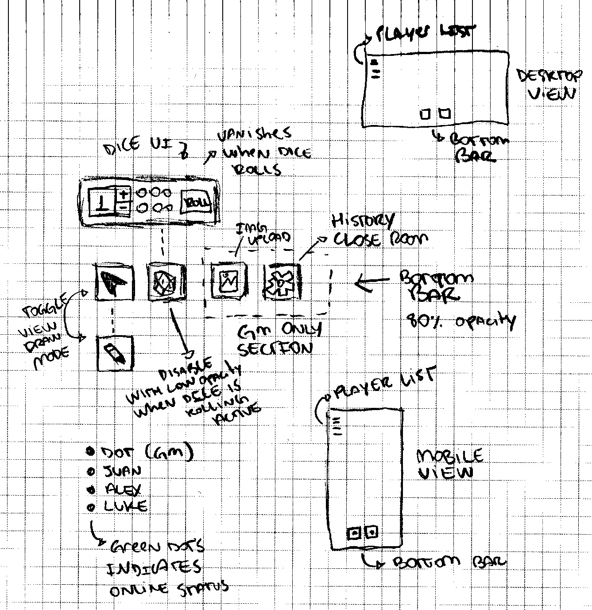
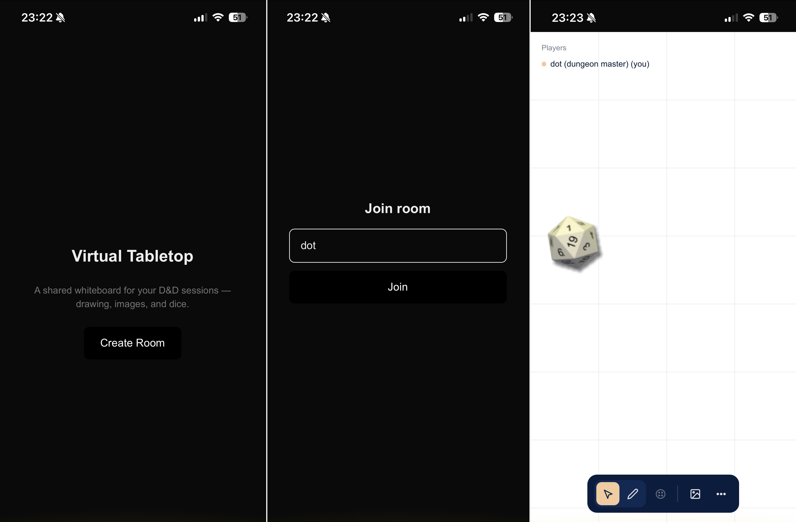

Eu sou um narrador velha guarda quando se trata de __RPG de mesa__, meu sistema favorito é *Dungeons & Dragons B/X de 1981*, e além disso, não sou muito fã do uso de miniaturas e acessórios. Muito da experiência que gosto de passar para as pessoas que jogam comigo envolve apenas o [teatro da mente](https://www.rederpg.com.br/2018/01/07/dd-teatro-da-mente-ou-como-jogar-dd-sem-grid/), um papel e rolagem de dados.

> 🔰 **Essa publicação visa inspirar iniciantes**  
> Por conta disso não pretendo explorar uso
> de agentes ou discussão sobre harness,
> ou diferentes modelos, apenas o __básico do Claude__
> em seu plano gratuito.

Decidi construir um __Virtual Tabletop básico__ para poder jogar online com amigos que moram longe, e inicialmente tive 3 objetivos principais:

  1. Um canvas que receba imagens e desenhos
  2. Dados em 3D para uma experiência mais realista
  3. Suporte para diferentes dispositivos (mobile friendly)

Então resolvi rabiscar algumas ideias para consolidar o visual do *MVP* que eu gostaria de construir, resultando nisso:

Não é a primeira vez que tento realizar esse projeto, das outras vezes senti dificuldade em lidar com a biblioteca de rolagem de dados em 3D e sabia que isso voltaria a ser um desafio, então decidi fazer um uso assistivo de I.A. para auxiliar no desenvolvimento, usando o Claude Code.

## A skill grill-me

Venho acompanhando o [trabalho do Matt Pocock](https://www.youtube.com/@mattpocockuk) recentemente, gosto bastante do jeito que ele compartilha os pensamentos e resultados de seus usos de I.A. e a [`grill-me`](https://github.com/mattpocock/skills/blob/733d312884b3878a9a9cff693c5886943753a741/skills/productivity/grill-me/SKILL.md) é uma skill bem famosa que ele construiu, então resolvi usar no início do projeto para criar um __plano de desenvolvimento__.

O resultado foi muito mais interessante do que imaginei: foram *100 perguntas* feitas, de modo gradual, que me ajudaram a entender melhor toda a arquitetura e decisões sobre o projeto, e entre elas, algumas que mais me chamaram a atenção foram:

  - Autenticação guest-first por link compartilhável (anonymous auth do supabase);
  - 24h de tempo de vida para as salas criadas, garantindo assim um uso melhor dos planos gratuitos de banco de dados e servidores;
  - Transferência automática de narrador quando o host sair da sala, além da devolução automática de controle quando o host entrar novamente;
  - Limites de participantes, desenhos e imagens mais coerentes de acordo com o plano gratuito do supabase;
  - E outras ideias que me ajudaram a enxergar uma solução mais robusta, mesmo para um MVP.

Garanti também que o Claude não assumisse o papel de desenvolvedor completo, a ideia aqui era que ele funcionasse como um assistente, me guiando pelas etapas necessárias para o desenvolvimento do projeto e tirando dúvidas sobre algumas implementações.

O projeto então foi definido em 7 fases:

  1. Setup Supabase (schema, RLS, cronjobs, permissões)
  2. Criação das salas com autenticação guest-first
  3. Implementação do quadro-branco com `react-konva`
  4. Implementação do upload de imagens
  5. Presença de múltiplos usuários e transferência de host
  6. Rolagem de dados
  7. Limites e limpeza de dados com TTL

## Assistências do Claude

Durante o percurso, o Claude me ajudou a determinar de uma maneira mais eficiente o schema para o Supabase, além de políticas de RLS (Row Level Security) e cronjobs para o TTL (Time To Live) das salas criadas. Eu tenho pouco conhecimento em banco de dados e backend num geral, então esse suporte foi extremamente bem vindo, me ajudou a entender as decisões tomadas.

Depois avançamos para implementar o [react-konva](https://github.com/konvajs/react-konva) para fazer o quadro-branco da aplicação e vincular os eventos de desenho ao RPC (Remote Procedure Call) do Supabase, upload de imagens, presença multiplayer e rolagem de dados — e dessa vez a implementação da lib para rolagem de dados foi super tranquila de implementar graças à ajuda do Claude, utilizando [@3d-dice/dice-box-threejs](https://github.com/3d-dice/dice-box-threejs).

Finalizei o projeto criando os limites de imagem, jogadores e desenho. Terminei também a UI o CSS com CSS Modules, além de alguns ajustes de metadata para o NextJS.

Fiquei super satisfeito com o resultado final, estou ansioso para testar com alguns amigos em sessões de RPG online. Foram 3 dias de projeto em tempo livre que me mostraram mais uma vez que o uso da I.A. assistida é uma ótima maneira de acelerar implementações e dar vida a ideias.

Então se você está com alguma ideia pra tirar do papel em tempo livre, espero que essa publicação possa te servir como inspiração.

Até a próxima! 👋🏾
