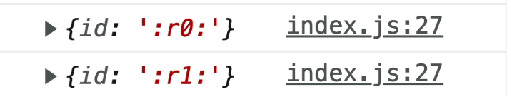

Se você já deu uma olhada na [documentação de design para desenvolvedores](https://www.chromium.org/developers/design-documents/create-amazing-password-forms) do *The Chromium Projects*, provavelmente encontrou a seguinte recomendação na seção `Create Amazing Password Forms`:

> Os navegadores foram projetados levando em consideração a especificação HTML, e ir contra ela pode causar comportamentos inesperados na sua página. Isso significa:
>
> Os atributos `id` dos elementos devem ser únicos: dois elementos não podem ter o mesmo `id`.

Mas, na prática, é extremamente comum termos componentes compartilhados reutilizando o mesmo ID em diferentes partes da aplicação — principalmente quando existem __múltiplas instâncias do mesmo componente sendo renderizadas na mesma página__.

Um dos exemplos mais clássicos disso é um componente de *LoginForm*:

```tsx
// <LoginForm /> component:
function LoginForm() => (
  <form>
    ...
    <label htmlFor="username">
      Username
    </label>
    <input
      id="username"
      type="text"
      name="username"
      placeholder="Username"
    />
    ...
  </form>
);
...
```

```tsx
// Homepage
<>
  <header>
    <LoginForm /> {/* primeira instância */}
  </header>
  <main>
    ...
  </main>
  <footer>
    <LoginForm /> {/* segunda instância */}
  </footer>
</>
```

Perceba que as duas instâncias do componente *LoginForm* acabam gerando o mesmo ID (`username`), o que não é permitido pela especificação HTML.

E eu sei que muita gente pode pensar em resolver isso passando uma prop `id` diferente para cada instância do componente. Funciona? Até funciona. Mas não é a melhor abordagem.

## É aí que entra o hook __React.useId()__

O React oferece o hook `useId`, que gera um ID único para cada instância do componente.

```tsx
import { useId } from 'react';

function LoginForm() {
  const id = useId();
  const usernameId = `${id}-username`;

  return (
    <form>
      <label htmlFor={usernameId}>
        Username
      </label>
      <input
        id={usernameId}
        type="text"
        name="username"
        placeholder="Username"
      />
    </form>
  );
}
```

Se você der um console.log no valor de `id`, verá algo parecido com isso:


E o melhor: esse valor permanece o mesmo entre re-renderizações do componente, o que torna essa solução muito mais confiável do que depender de props manuais ou alternativas como __Math.random()__.

Até a próxima! 👋🏾
